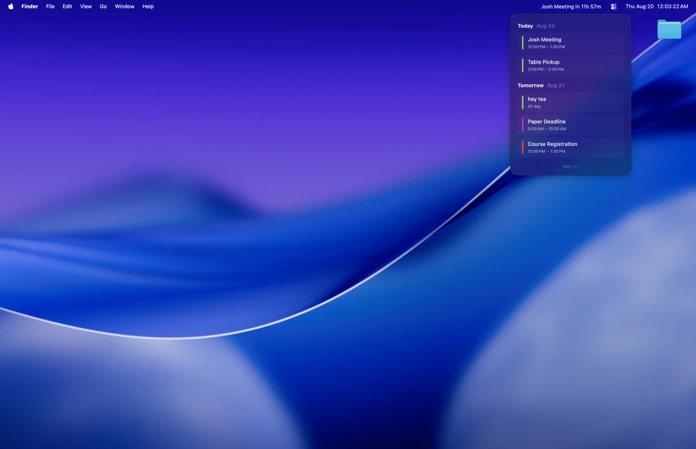
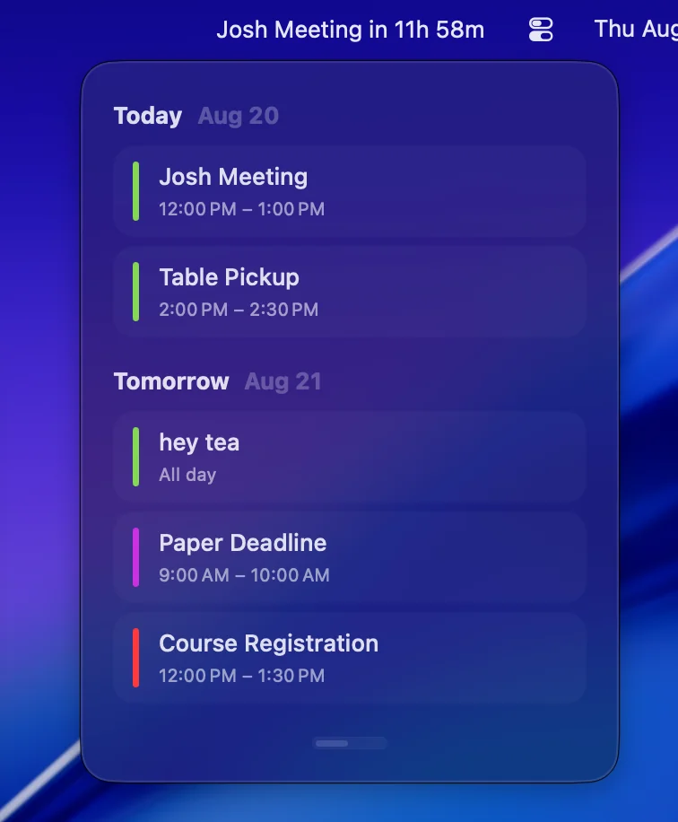

# CalendarBar

CalendarBar is a lightweight macOS menu bar calendar that keeps your next event visible without making you open the Calendar app.

The menu bar shows a live countdown to the next event. Click it to see a compact, color-coded schedule for the next 48 hours.



## Features

- Shows the next event and its remaining time in the menu bar
- Displays upcoming events in a rolling 48-hour view
- Includes ongoing, timed, and all-day events
- Uses the colors from your Apple calendars
- Lets you choose which calendars are included
- Opens an event in Apple Calendar when clicked
- Provides local reminders 10 and 5 minutes before an event
- Respects reminder times already attached to calendar events
- Supports system, light, and dark appearances
- Supports English and Simplified Chinese
- Can launch automatically when you sign in



## How it works

CalendarBar reads events through Apple's EventKit framework, the same system interface used by calendar apps on macOS. After you grant Calendar access, events are loaded into a small local cache and filtered according to the calendars and time range you select.

The app has two native interface layers:

- **AppKit** manages the menu bar item, popover window, and system-level behavior.
- **SwiftUI** renders the event list, settings, and reminder interface.

Event processing, countdown updates, and reminders all run locally on your Mac. CalendarBar does not require an account, send event data to a server, or include third-party analytics.

## Requirements

- macOS 13 or later
- Apple Silicon or Intel Mac
- Xcode 15 or later when building from source

## Build from source

Clone the repository and build the application bundle:

```bash
git clone https://github.com/Shibx12/Calendar.git
cd Calendar
make app
open dist/CalendarBar.app
```

The finished application is created at `dist/CalendarBar.app` and signed locally for use on the current Mac. On first launch, macOS will ask for permission to read your calendars.

Run the test suite with:

```bash
make test
```

## Settings

Open CalendarBar and switch to the settings page to:

- Select the calendars you want to include
- Set the menu bar look-ahead range from 1 to 72 hours
- Control how soon the next event appears while another event is in progress
- Show or hide the current event
- Change appearance and language
- Enable launch at login

The dropdown schedule always covers the next 48 hours. The configurable look-ahead range controls which event is summarized in the menu bar.

## Privacy

CalendarBar reads calendar data only after macOS grants permission. It does not modify events, use a remote service, or store a separate calendar database. You can revoke access at any time in **System Settings → Privacy & Security → Calendars**.

## Contributing

Bug reports, feature ideas, and pull requests are welcome. If you find a problem, please include your macOS version and clear steps to reproduce it.
